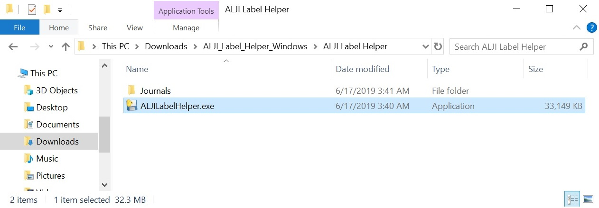
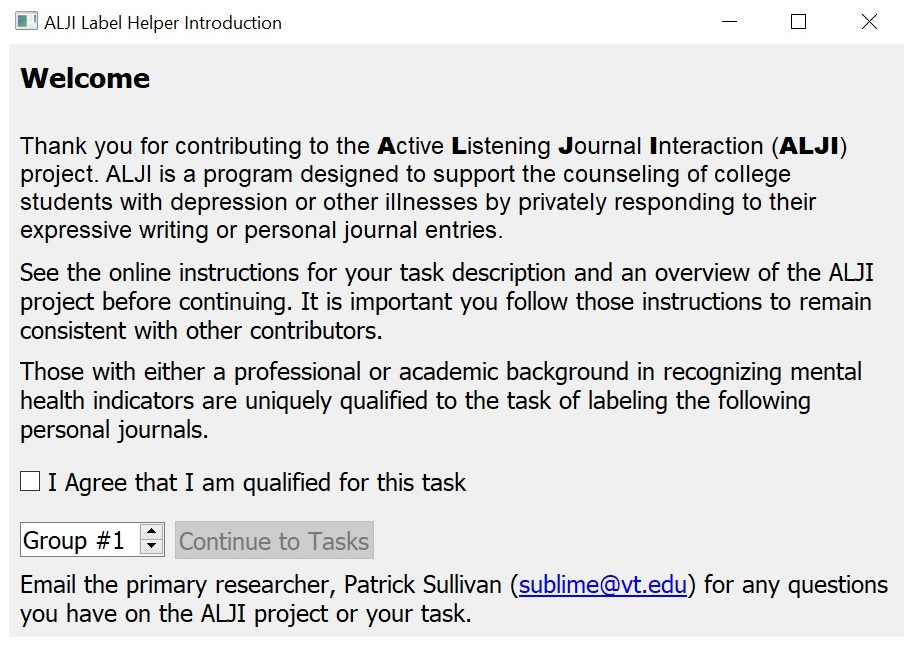

[<- Back to contribute page](./contribute)

### Label Helper Setup

The setup process is just three small steps:
1. Download the zip file
1. Uncompress the zip file
1. Run the Label Helper

*Note:* ALJI Label Helper has only been tested on Windows 10 and 
on Mac OSX 10.4 (Mojave).  Other systems may may vary in results.  

Here's the detailed walk-through of the entire setup:

#### Download the zip file

1. Click the download link for your operating system:
    - [**Windows users download link**](https://github.com/sublime09/ALJI/releases/latest/download/ALJI_Label_Helper_Windows.zip)
    - [**Mac (OSX) users download link**](https://github.com/sublime09/ALJI/releases/latest/download/ALJI_Label_Helper_Mac.zip)
    - If you are given the option to save or open the file, choose *save*
1. Save the file in a familiar location
    - Your computer's setting may automatically download the file to your 'downloads' folder: 

#### Uncompress the zip file

*Note:* Uncompress, unzip, and extract all have the same meaning in most cases

A larger, more comprehensive guide for unzipping files can be found [here for Windows](https://www.wikihow.com/Unzip-a-File) and [here for Mac](https://www.wikihow.com/Unzip-a-.Zip-File-on-a-Mac).  However, these simple steps may suffice:

1. Select the 'zip' file that you downloaded: 
1. From the 'Compressed Folder Tools' menu, select 'Extract all' 
1. The zip file will take less than a minute to extract. 
1. You should now notice a folder has been created from the zip file 
1. You can now delete the zip file; it is no longer needed.  You will need the folder for the labeling task. 

#### Run the Label Helper

1. In the 'ALJI Label Helper' folder, you should see a file called 'ALJILabelHelper'.  That is the application we will use.  Double click it to begin
    - Your computer may warn you about running this program.  This is because Microsoft and Apple do not know me (the developer) very well.  I can assure you that *every piece of code* I have written for this project can be scrutinized from the project's [github repository](https://github.com/sublime09/ALJI).  
        - Windows users may see [this screen](./assets/img/protect1.jpg).  Clicking 'more info' reveals an option to 'Run anyway' as [seen here](./assets/img/protect2.jpg). 
        - [Tutorial: Opening an app from an unsigned developer on Mac](https://www.wikihow.com/Install-Software-from-Unsigned-Developers-on-a-Mac)
        - Mac users may also be able to simply move the entire 'ALJI Label Helper' folder inside the 'Applications' folder to unlock the application. 
1. The ALJI Label Helper should be opened and running. *Do not continue until you have read all the instructions within the next section!* .  
    

#### Troubleshooting / Reporting errors:
- Contact Patrick: [sublime@vt.edu](mailto:sublime@vt.edu?subect=ALJI_error) and describe the error you encountered.
- A screenshot of the error is usually very helpful
- If it exists, attaching the “err.log” file found near the program may help as well.

[<- Back to contribute page](./contribute)

[-> Forward to Task Instructions page](./labelHelperTask)
