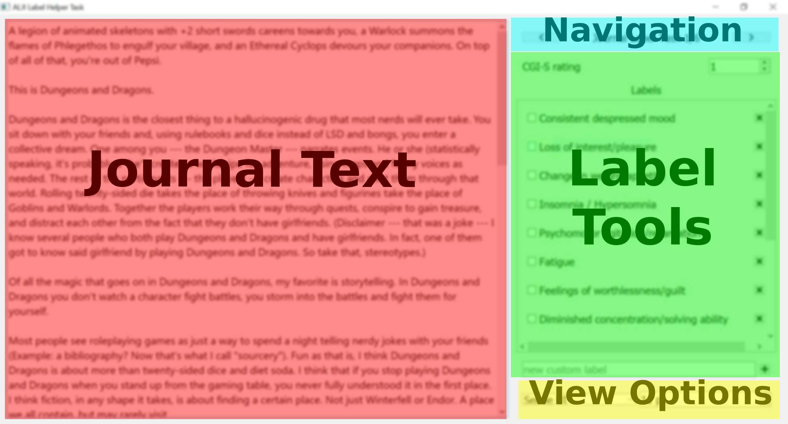

[<- Back to contribute page](./contribute)

## Task Labeling

**It is important you follow this guide when labeling journal entries to remain consistent with the other contributors:**

1. Read the task details on the 'splash' screen after starting the "ALJILabelHelper" application. ([reference screenshot](./assets/img/running.jpg))
1. ***Select your assigned Group Number*** which was assigned to you within your email contact with the researcher.  Agree to the task's instructions and qualifications, and select 'Continue'. 
1. Read the entire passage as if it is an entry in someone's personal journal or diary
1. Consider the mental wellness of the author (assume the author is a high school senior in the USA, age 18)
1. Based off of the information in the entry, estimate the author’s [**​CGI-S rating**](./CGIS_Scale). Input this rating into the box in the upper right of the screen.
    - **Known bug in Macs**: sometimes the main view appears frozen and doesn't respond to input.
        - *Workaround*: Scrolling in the main view, or navigating to between journals will refresh the view.  Your work should be saved, it just is not being display correctly.  
1. Take note of *any* passages that are alarming or concerning, even if it is a single sentence.  
    - [**Examples for reference**](./concernExamples) of concerning passages and the labels to select
    - *Note:* A mental health indicator from the author's past can still be concerning if the author could be experiencing the same indicator in the present.  
1. If there are concerns, clarify this by 'checking' the applicable labels (see below screenshots). Some default labels are provided, and you may name custom labels and add them for indicators beyond the default labels list.  
    - In the final prototype of ALJI, these concerns will first be confirmed by the author before referring them to mental health support services. (e.g. "This sounds like you currently have insomnia and are feeling fatigued.  Is that correct?")
1. After labeling all journals within your group (6-7 journals), report your label results to the researcher (instructions are on next page)

[<- Back to contribute page](./contribute)

[-> Forward to Report Label Results page](./labelHelperReport)

### Interface description and screenshots:

---

---

---

[<- Back to contribute page](./contribute)

[-> Forward to Report Label Results page](./labelHelperReport)